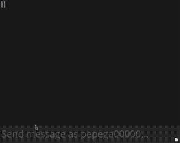

# About

Lovcen (/lôːʋtɕen/) is a sophisticated [Twitch.tv](https://www.twitch.tv) chat bot made in Rust.

## Underlying technologies

- Rust
	- twitch-irc
		- used as a twitch irc client
	- sqlx
		- used as an SQLite database driver
	- \[and a bunch of others... view [Cargo.toml](Cargo.toml) for further information\]

# Commands

| Command        | Args                                                                       | Description                                                        | Required status
| ---            | ---                                                                        | ---                                                                | ---
| [prefix]       | [alias name: str]                                                          | execute an alias                                                   | None
| accage         | [name: opt(str)]                                                           | get the account age of spec. user or one's self                    | None
| bench          | Command                                                                    | measure how long a command takes to execute                        | None
| bible          | None                                                                       | get a random verse from the bible                                  | None
| cf             | None                                                                       | classic coinflip                                                   | None
| clearreminders | None                                                                       | clears all reminders the user has set (that are still pending)     | None
| commands       | None                                                                       | returns a link to the command list (according to config file)      | None
| chatstats      | [period: str] [mode: str]                                                  | get the chat statistics of a channel                               | None
| decide         | [options: comma-separated text]                                            | indecisive? let pseudorandomness choose                            | None
| delcmd         | [name: str]                                                                | delete a channel command                                           | Broadcaster/Moderator/VIP
| demultiplex    | [iterations: int] [command expression]                                     | repeat a command multiple times                                    | Broadcaster/Moderator/VIP
| define         | [word: str]                                                                | queries a dictionary API for a word definition                     | None
| echo           | [text]                                                                     | repeats user's message                                             | Broadcaster/Moderator/VIP
| explain        | [error code: str]                                                          | returns an explanation of an error                                 | None
| first          | [nick: opt(str)] [channel: opt(str)]                                       | get the first logged message of a user (in any channel)            | None
| followage      | [user: opt(str)] [channel: opt(str)]                                       | get the amount of time a user has been following a channel         | None
| giveup         | None                                                                       | give up the current trivia question                                | None
| inspireme      | None                                                                       | get inspired                                                       | None
| lastseen       | [user: str]                                                                | alias for the `ls` command                                         | None
| ls             | [user: str]                                                                | find when and where was specified user last seen                   | None
| lurk           | None                                                                       | go into lurk mode (gets removed upon next message)                 | None
| markov         | [start: str] [count: int]                                                  | responds with a markov chain generated from saved chat messages    | None
| math           | [expression: text]                                                         | alias for the `query` command                                      | None
| newcmd         | [type: templ\|paste\|incr] [expression: str]                               | create a new channel command                                       | Broadcaster/Moderator/VIP
| offlinetime    | [name: opt(str)]                                                           | returns the time a user has thus far spent in offline chat         | None
| pasta          | None                                                                       | random copypasta from `assets/copypastas.json` (no ascii art)      | None
| ping           | None                                                                       | responds with "pong"                                               | None
| query          | [query: text]                                                              | query WolframAlpha for some question/equation/we                   | None
| quran          | None                                                                       | get a random verse from the quran                                  | None
| random         | [int] [opt(int)]                                                           | generate a random number from a range                              | None
| reddit         | [r/: str] opt(random/upvotes) opt(media) opt(hour/day/week/month/year/all) | get a post from reddit                                             | None
| remind         | (xh,xm) [user: str] [text]                                                 | reminds user when he types if spec. amouunt of time has passed     | None
| remindme       | (xh,xm) [text]                                                             | shortcut for reminding one's self                                  | None
| rose           | None                                                                       | send a rose to a random fellow chatter!                            | None
| rmalias        | [alias name: str]                                                          | remove an alias                                                    | None
| rmrm           | None                                                                       | alias for the `clearreminders` command                             | None
| setalias       | [name: str] [cmd expression]                                               | set an alias for caller (like a substitue for specificied command) | None
| suggest        | [suggestion: text]                                                         | suggest something to the bot maintainer                            | None
| tanakh         | None                                                                       | get a random verse from the tanakh                                 | None
| time           | [location: text]                                                           | get the local time in the specified location                       | None
| trivia         | opt(hard/easy/medium) opt(...category) opt(multiple/true false)            | start a trivia game (anyone in the chat can answer)                | None
| uptime         | [channel: opt(str)]                                                        | get the uptime of a streamer                                       | None
| urban          | [term: text]                                                               | queries urbandictionary for a phrase                               | None
| weather        | [location: text]                                                           | get weather report from specified location                         | None
| wiki           | [phrase: text]                                                             | tries to query Wikipedia for searched topic/title                  | None
| wordratio      | [user: opt(str)] [word: str]                                               | get the ratio of messages of a user that contain certain word      | None

# Run yourself

1. `git clone https://github.com/dynamo58/twitch-bot`
2. rename `.env.example` to `.env` and enter your information for the different APIs
	- in fact, you only really need the Twitch info, but if you do not provide the other ones, quite a lot of commands will simply not work (see list below of all the APIs and their utilization)
3. tweak your config in `assets/config.json`
4. create a blank `db.db` file in the root
5. everything set up, you can do `cargo run` or something

# Credits

This bot is heavily inspired by other Twitch bots, takes some of their features and in some cases tries to build on top of them. Those are, most notably,
- [Supibot](https://github.com/Supinic/supibot) made by [Supinic](https://www.twitch.tv/supinic)
- [kbot](https://github.com/KUNszg/kbot) made by [KUNszg](https://kunszg.com/)

This bot also uses various third-party APIs, those include (but may not be limited to)
- [Twitch API](https://dev.twitch.tv/docs/api/); obviously
- [OpenTDB](https://opentdb.com/) for querying trivia questions
- [ipgeolocation]() for timezone api [no link here because site may and will show personal information]
- [Pastebin](https://pastebin.com/) dumping data on demand
- [wttr.in]() to query weather information [no link because may and will show location]
- [Devotionalium](https://devotionalium.com/web) to query verses of books
- [Reddit](https://www.reddit.com/) to query Reddit posts
- [Urban Dictionary](https://www.urbandictionary.com/) to query Urban dictionary posts
- [Wikipedia](https://en.wikipedia.org/wiki/Main_Page) to query gists of Wiki posts
- [Dictionary API](https://dictionaryapi.dev/) to query english dictionary words
- [WoframAlpha](https://products.wolframalpha.com/api/) to query questions (mainly as a platform for a solid `math` command)
- [InspiroBot](https://inspirobot.me/api?generate=true) to get high quality inspirations

# Examples

The bot by has grown to have many features, check out some of the commands one could use!

  
  
  
  
  

