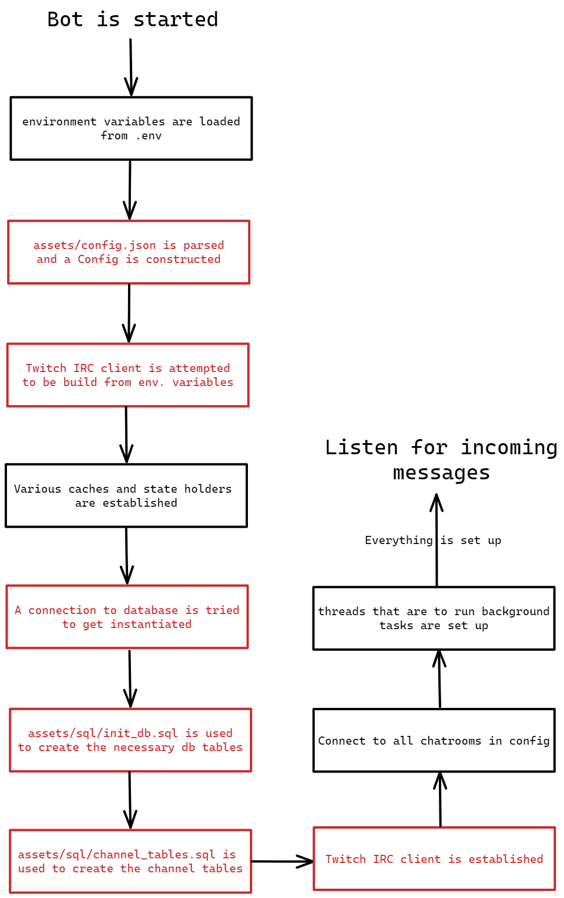

# About this section

This file tries to indicate how the program works and explain its structure.

# Anotation

The bot consists of various components in order to be able to provide all of the things it is supposed to.

# Notation convention

All of the following diagrams include the following conventions:

-  **Actions** that may cause the program to abort are in red

- **Actions/Decisions** may have little purple labels next to them; those are for relating the description to a section of code

# Initialization

 
